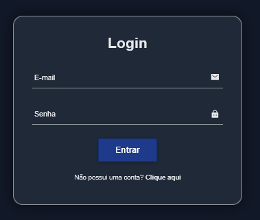
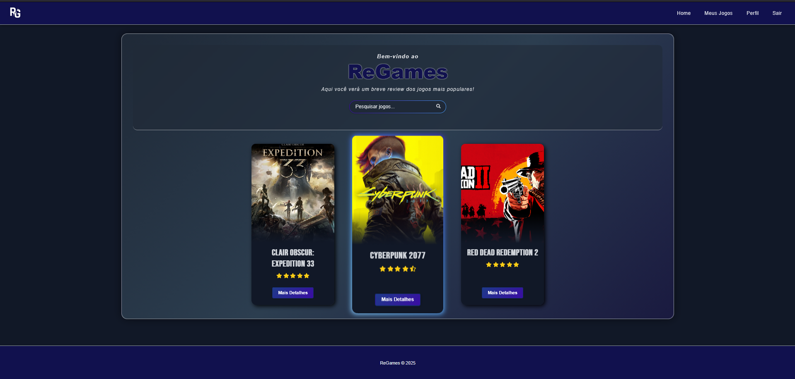
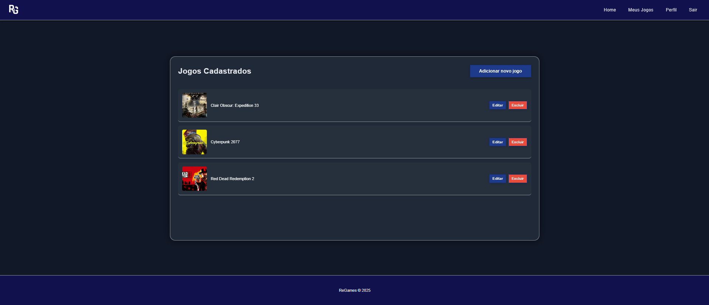
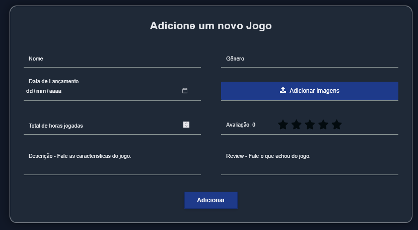
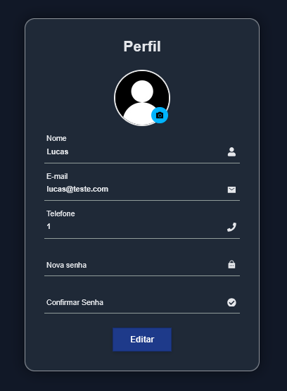

# 🎮 ReGames

Bem-vindo ao **ReGames**!Este é o meu primeiro projeto full-stack, desenvolvido de ponta a ponta inteiramente por mim. O objetivo principal deste projeto foi puramente acadêmico e de autodesenvolvimento, servindo como um laboratório prático para consolidar meus conhecimentos na construção de aplicações web modernas.

## 📸 Telas da Aplicação

### Tela de Login e Autenticação

### Dashboard Principal

### Gerenciamento: Meus Jogos

### Inserção de Dados: Adicionar Jogo

### Configurações: Perfil do Usuário

---

## 📌 Sobre o Projeto

O ReGames é uma aplicação web que funciona como um catálogo dinâmico de jogos. Ele permite o gerenciamento completo de usuários e jogos (CRUD), abordando desde a criação da interface do cliente até a modelagem do banco de dados e a construção da API. 

Este projeto marca a minha transição para o desenvolvimento full-stack, onde pude lidar com desafios reais como autenticação de usuários, upload de múltiplas imagens, e a comunicação segura entre front-end e back-end.

## 🛠️ Tecnologias Utilizadas

A base do projeto foi construída utilizando o ecossistema JavaScript:

### Front-end
* **React 19 & Vite:** Para uma interface de usuário rápida e baseada em componentes.
* **React Router v7:** Gerenciamento de rotas e navegação da aplicação.
* **Context API & Custom Hooks:** Gerenciamento de estado global (ex: `UsuarioContext` e `useAuth`).
* **Axios:** Integração via requisições HTTP seguras com a API.
* **CSS3:** Estilização da interface.

### Back-end
* **Node.js & Express:** Servidor e roteamento da API.
* **Arquitetura MVC:** Separação clara entre Models, Views (neste caso, o Front-end) e Controllers.
* **Sequelize (ORM):** Modelagem e gestão do banco de dados relacional.
* **JWT (JSON Web Token) & Bcrypt:** Sistema robusto de segurança para hash de senhas e proteção de rotas.
* **Multer / File System (`fs`):** Upload e gerenciamento de imagens (incluindo lógica de limpeza de "imagens órfãs" no servidor).

## 🚀 Principais Funcionalidades

* **Sistema de Autenticação:** Login seguro com geração e validação de tokens JWT.
* **Gestão de Perfil:** Criação e edição de usuários, incluindo upload de imagem de perfil.
* **Catálogo de Jogos:** Cadastro detalhado de jogos com suporte ao envio de imagens de demonstração.
* **Validação de Dados:** Prevenção de erros de envio e lógicas de segurança no lado do servidor.

---

Desenvolvido por João Lucas Guimarães
